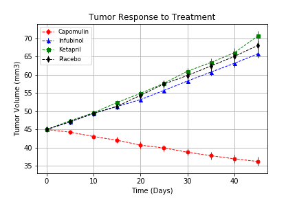
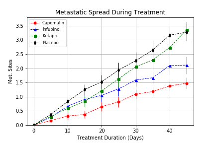
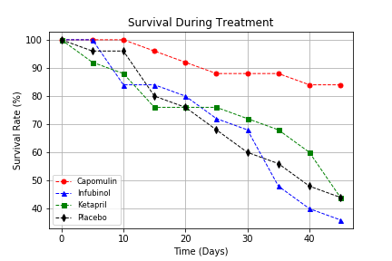
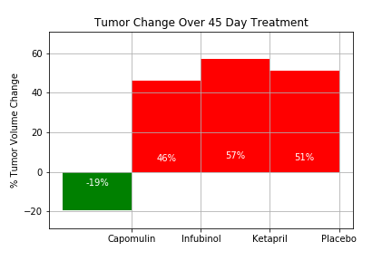

Pymaceuticals Inc


While your data companions rushed off to jobs in finance and government, you remained adamant that science was the way for you. Staying true to your mission, you've since joined Pymaceuticals Inc., a burgeoning pharmaceutical company based out of San Diego, CA. Pymaceuticals specializes in drug-based, anti-cancer pharmaceuticals. In their most recent efforts, they've since begun screening for potential treatments to squamous cell carcinoma (SCC), a commonly occurring form of skin cancer.

As their Chief Data Analyst, you've been given access to the complete data from their most recent animal study. In this study, 250 mice were treated through a variety of drug regimes over the course of 45 days. Their physiological responses were then monitored over the course of that time. Your objective is to analyze the data to show how four treatments (Capomulin, Infubinol, Ketapril, and Placebo) compare.

To do this you are tasked with:

* Creating a scatter plot that shows how the tumor volume changes over time for each treatment.
* Creating a scatter plot that shows how the number of [metastatic](https://en.wikipedia.org/wiki/Metastasis) (cancer spreading) sites changes over time for each treatment.
* Creating a scatter plot that shows the number of mice still alive through the course of treatment (Survival Rate)
* Creating a bar graph that compares the total % tumor volume change for each drug across the full 45 days.

## Analysis

* It's possible to notice that Capomulin had best results than Infubinol, Ketapril and Placebo in Tumor Volume (mm3), Metastatic Sites and Survival Rate. The mice treated with this drug had 20% average tumor decrease.

* Mice treated with Infubinol had better resuts in Tumor Volume and Metastatic Sites than placebo, but the Survival Rate for mice treated with Infubinol was 33%, the worst among analyzed drugs.

* Mice treated with Ketapril had a similar result with mice treated with Placebo.


```python
# Dependencies and Setup
%matplotlib inline
import matplotlib.pyplot as plt
import pandas as pd
import numpy as np
import os

# Hide warning messages in notebook
import warnings
warnings.filterwarnings('ignore')

# Data Files
mouse_drug_data_file = os.path.join("Resources","mouse_drug_data.csv")
clinical_trial_data_file = os.path.join("Resources","clinicaltrial_data.csv")

# Read the Mouse and Drug Data and the Clinical Trial Data
mouse_drug_raw_data = pd.read_csv(mouse_drug_data_file)
clinical_trial_raw_data = pd.read_csv(clinical_trial_data_file)
```


```python
# Version of libraries used on this project
# Please verify the version if some problem occurs

#pd.__version__ # Pandas Version: 0.23.4
#import matplotlib
#matplotlib.__version__ # Matplotlib Version: 3.0.2
#np.__version__ # Numpy Version: 1.15.4
```


```python
# Display Mouse and Drug Data
print(mouse_drug_raw_data.head())

print("---------------------")

# Verify number of rows
print(mouse_drug_raw_data.count())
```

      Mouse ID      Drug
    0     f234  Stelasyn
    1     x402  Stelasyn
    2     a492  Stelasyn
    3     w540  Stelasyn
    4     v764  Stelasyn
    ---------------------
    Mouse ID    250
    Drug        250
    dtype: int64


```python
# Display Clinical Data
print(clinical_trial_raw_data.head())

print("---------------------")

# Verify number of rows
print(clinical_trial_raw_data.count())
```

      Mouse ID  Timepoint  Tumor Volume (mm3)  Metastatic Sites
    0     b128          0                45.0                 0
    1     f932          0                45.0                 0
    2     g107          0                45.0                 0
    3     a457          0                45.0                 0
    4     c819          0                45.0                 0
    ---------------------
    Mouse ID              1893
    Timepoint             1893
    Tumor Volume (mm3)    1893
    Metastatic Sites      1893
    dtype: int64


```python
# Combine the data into a single dataset
combined_raw_data = pd.merge(clinical_trial_raw_data,mouse_drug_raw_data,on='Mouse ID')

# Display the combined dataset table
combined_raw_data.head()
```


<div>
<style scoped>
    .dataframe tbody tr th:only-of-type {
        vertical-align: middle;
    }

    .dataframe tbody tr th {
        vertical-align: top;
    }

    .dataframe thead th {
        text-align: right;
    }
</style>
<table border="1" class="dataframe">
  <thead>
    <tr style="text-align: right;">
      <th></th>
      <th>Mouse ID</th>
      <th>Timepoint</th>
      <th>Tumor Volume (mm3)</th>
      <th>Metastatic Sites</th>
      <th>Drug</th>
    </tr>
  </thead>
  <tbody>
    <tr>
      <th>0</th>
      <td>b128</td>
      <td>0</td>
      <td>45.000000</td>
      <td>0</td>
      <td>Capomulin</td>
    </tr>
    <tr>
      <th>1</th>
      <td>b128</td>
      <td>5</td>
      <td>45.651331</td>
      <td>0</td>
      <td>Capomulin</td>
    </tr>
    <tr>
      <th>2</th>
      <td>b128</td>
      <td>10</td>
      <td>43.270852</td>
      <td>0</td>
      <td>Capomulin</td>
    </tr>
    <tr>
      <th>3</th>
      <td>b128</td>
      <td>15</td>
      <td>43.784893</td>
      <td>0</td>
      <td>Capomulin</td>
    </tr>
    <tr>
      <th>4</th>
      <td>b128</td>
      <td>20</td>
      <td>42.731552</td>
      <td>0</td>
      <td>Capomulin</td>
    </tr>
  </tbody>
</table>
</div>


## Tumor Response to Treatment


```python
# Store the Mean Tumor Volume Data Grouped by Drug and Timepoint and Convert to DataFrame
tumor_response_data_grp = combined_raw_data.groupby(["Drug","Timepoint"])
tumor_response_mean_volume_grp = pd.DataFrame(tumor_response_data_grp["Tumor Volume (mm3)"].mean())

# Ungroup DataFrame
tumor_response_mean_volume = tumor_response_mean_volume_grp.reset_index()

# Preview DataFrame
tumor_response_mean_volume.head()
```


<div>
<style scoped>
    .dataframe tbody tr th:only-of-type {
        vertical-align: middle;
    }

    .dataframe tbody tr th {
        vertical-align: top;
    }

    .dataframe thead th {
        text-align: right;
    }
</style>
<table border="1" class="dataframe">
  <thead>
    <tr style="text-align: right;">
      <th></th>
      <th>Drug</th>
      <th>Timepoint</th>
      <th>Tumor Volume (mm3)</th>
    </tr>
  </thead>
  <tbody>
    <tr>
      <th>0</th>
      <td>Capomulin</td>
      <td>0</td>
      <td>45.000000</td>
    </tr>
    <tr>
      <th>1</th>
      <td>Capomulin</td>
      <td>5</td>
      <td>44.266086</td>
    </tr>
    <tr>
      <th>2</th>
      <td>Capomulin</td>
      <td>10</td>
      <td>43.084291</td>
    </tr>
    <tr>
      <th>3</th>
      <td>Capomulin</td>
      <td>15</td>
      <td>42.064317</td>
    </tr>
    <tr>
      <th>4</th>
      <td>Capomulin</td>
      <td>20</td>
      <td>40.716325</td>
    </tr>
  </tbody>
</table>
</div>


```python
# Store the Standard Error of Tumor Volumes Grouped by Drug and Timepoint and Convert to DataFrame
tumor_response_sem_volume_grp = pd.DataFrame(tumor_response_data_grp["Tumor Volume (mm3)"].sem())
tumor_response_sem_volume = tumor_response_sem_volume_grp.reset_index()

# Preview DataFrame
tumor_response_sem_volume.head()
```


<div>
<style scoped>
    .dataframe tbody tr th:only-of-type {
        vertical-align: middle;
    }

    .dataframe tbody tr th {
        vertical-align: top;
    }

    .dataframe thead th {
        text-align: right;
    }
</style>
<table border="1" class="dataframe">
  <thead>
    <tr style="text-align: right;">
      <th></th>
      <th>Drug</th>
      <th>Timepoint</th>
      <th>Tumor Volume (mm3)</th>
    </tr>
  </thead>
  <tbody>
    <tr>
      <th>0</th>
      <td>Capomulin</td>
      <td>0</td>
      <td>0.000000</td>
    </tr>
    <tr>
      <th>1</th>
      <td>Capomulin</td>
      <td>5</td>
      <td>0.448593</td>
    </tr>
    <tr>
      <th>2</th>
      <td>Capomulin</td>
      <td>10</td>
      <td>0.702684</td>
    </tr>
    <tr>
      <th>3</th>
      <td>Capomulin</td>
      <td>15</td>
      <td>0.838617</td>
    </tr>
    <tr>
      <th>4</th>
      <td>Capomulin</td>
      <td>20</td>
      <td>0.909731</td>
    </tr>
  </tbody>
</table>
</div>


```python
# Minor Data Munging to Re-Format the Mean Volume DataFrame
tumor_response_mean_volume_pvt = tumor_response_mean_volume.pivot_table(values = "Tumor Volume (mm3)",index="Timepoint",columns="Drug")

# Preview DataFrame
tumor_response_mean_volume_pvt
```


<div>
<style scoped>
    .dataframe tbody tr th:only-of-type {
        vertical-align: middle;
    }

    .dataframe tbody tr th {
        vertical-align: top;
    }

    .dataframe thead th {
        text-align: right;
    }
</style>
<table border="1" class="dataframe">
  <thead>
    <tr style="text-align: right;">
      <th>Drug</th>
      <th>Capomulin</th>
      <th>Ceftamin</th>
      <th>Infubinol</th>
      <th>Ketapril</th>
      <th>Naftisol</th>
      <th>Placebo</th>
      <th>Propriva</th>
      <th>Ramicane</th>
      <th>Stelasyn</th>
      <th>Zoniferol</th>
    </tr>
    <tr>
      <th>Timepoint</th>
      <th></th>
      <th></th>
      <th></th>
      <th></th>
      <th></th>
      <th></th>
      <th></th>
      <th></th>
      <th></th>
      <th></th>
    </tr>
  </thead>
  <tbody>
    <tr>
      <th>0</th>
      <td>45.000000</td>
      <td>45.000000</td>
      <td>45.000000</td>
      <td>45.000000</td>
      <td>45.000000</td>
      <td>45.000000</td>
      <td>45.000000</td>
      <td>45.000000</td>
      <td>45.000000</td>
      <td>45.000000</td>
    </tr>
    <tr>
      <th>5</th>
      <td>44.266086</td>
      <td>46.503051</td>
      <td>47.062001</td>
      <td>47.389175</td>
      <td>46.796098</td>
      <td>47.125589</td>
      <td>47.248967</td>
      <td>43.944859</td>
      <td>47.527452</td>
      <td>46.851818</td>
    </tr>
    <tr>
      <th>10</th>
      <td>43.084291</td>
      <td>48.285125</td>
      <td>49.403909</td>
      <td>49.582269</td>
      <td>48.694210</td>
      <td>49.423329</td>
      <td>49.101541</td>
      <td>42.531957</td>
      <td>49.463844</td>
      <td>48.689881</td>
    </tr>
    <tr>
      <th>15</th>
      <td>42.064317</td>
      <td>50.094055</td>
      <td>51.296397</td>
      <td>52.399974</td>
      <td>50.933018</td>
      <td>51.359742</td>
      <td>51.067318</td>
      <td>41.495061</td>
      <td>51.529409</td>
      <td>50.779059</td>
    </tr>
    <tr>
      <th>20</th>
      <td>40.716325</td>
      <td>52.157049</td>
      <td>53.197691</td>
      <td>54.920935</td>
      <td>53.644087</td>
      <td>54.364417</td>
      <td>53.346737</td>
      <td>40.238325</td>
      <td>54.067395</td>
      <td>53.170334</td>
    </tr>
    <tr>
      <th>25</th>
      <td>39.939528</td>
      <td>54.287674</td>
      <td>55.715252</td>
      <td>57.678982</td>
      <td>56.731968</td>
      <td>57.482574</td>
      <td>55.504138</td>
      <td>38.974300</td>
      <td>56.166123</td>
      <td>55.432935</td>
    </tr>
    <tr>
      <th>30</th>
      <td>38.769339</td>
      <td>56.769517</td>
      <td>58.299397</td>
      <td>60.994507</td>
      <td>59.559509</td>
      <td>59.809063</td>
      <td>58.196374</td>
      <td>38.703137</td>
      <td>59.826738</td>
      <td>57.713531</td>
    </tr>
    <tr>
      <th>35</th>
      <td>37.816839</td>
      <td>58.827548</td>
      <td>60.742461</td>
      <td>63.371686</td>
      <td>62.685087</td>
      <td>62.420615</td>
      <td>60.350199</td>
      <td>37.451996</td>
      <td>62.440699</td>
      <td>60.089372</td>
    </tr>
    <tr>
      <th>40</th>
      <td>36.958001</td>
      <td>61.467895</td>
      <td>63.162824</td>
      <td>66.068580</td>
      <td>65.600754</td>
      <td>65.052675</td>
      <td>63.045537</td>
      <td>36.574081</td>
      <td>65.356386</td>
      <td>62.916692</td>
    </tr>
    <tr>
      <th>45</th>
      <td>36.236114</td>
      <td>64.132421</td>
      <td>65.755562</td>
      <td>70.662958</td>
      <td>69.265506</td>
      <td>68.084082</td>
      <td>66.258529</td>
      <td>34.955595</td>
      <td>68.438310</td>
      <td>65.960888</td>
    </tr>
  </tbody>
</table>
</div>


```python
# Minor Data Munging to Re-Format the Standard Error DataFrame
tumor_response_sem_volume_pvt = tumor_response_sem_volume.pivot_table(values = "Tumor Volume (mm3)",index="Timepoint",columns="Drug")

# Preview DataFrame
tumor_response_sem_volume_pvt
```


<div>
<style scoped>
    .dataframe tbody tr th:only-of-type {
        vertical-align: middle;
    }

    .dataframe tbody tr th {
        vertical-align: top;
    }

    .dataframe thead th {
        text-align: right;
    }
</style>
<table border="1" class="dataframe">
  <thead>
    <tr style="text-align: right;">
      <th>Drug</th>
      <th>Capomulin</th>
      <th>Ceftamin</th>
      <th>Infubinol</th>
      <th>Ketapril</th>
      <th>Naftisol</th>
      <th>Placebo</th>
      <th>Propriva</th>
      <th>Ramicane</th>
      <th>Stelasyn</th>
      <th>Zoniferol</th>
    </tr>
    <tr>
      <th>Timepoint</th>
      <th></th>
      <th></th>
      <th></th>
      <th></th>
      <th></th>
      <th></th>
      <th></th>
      <th></th>
      <th></th>
      <th></th>
    </tr>
  </thead>
  <tbody>
    <tr>
      <th>0</th>
      <td>0.000000</td>
      <td>0.000000</td>
      <td>0.000000</td>
      <td>0.000000</td>
      <td>0.000000</td>
      <td>0.000000</td>
      <td>0.000000</td>
      <td>0.000000</td>
      <td>0.000000</td>
      <td>0.000000</td>
    </tr>
    <tr>
      <th>5</th>
      <td>0.448593</td>
      <td>0.164505</td>
      <td>0.235102</td>
      <td>0.264819</td>
      <td>0.202385</td>
      <td>0.218091</td>
      <td>0.231708</td>
      <td>0.482955</td>
      <td>0.239862</td>
      <td>0.188950</td>
    </tr>
    <tr>
      <th>10</th>
      <td>0.702684</td>
      <td>0.236144</td>
      <td>0.282346</td>
      <td>0.357421</td>
      <td>0.319415</td>
      <td>0.402064</td>
      <td>0.376195</td>
      <td>0.720225</td>
      <td>0.433678</td>
      <td>0.263949</td>
    </tr>
    <tr>
      <th>15</th>
      <td>0.838617</td>
      <td>0.332053</td>
      <td>0.357705</td>
      <td>0.580268</td>
      <td>0.444378</td>
      <td>0.614461</td>
      <td>0.466109</td>
      <td>0.770432</td>
      <td>0.493261</td>
      <td>0.370544</td>
    </tr>
    <tr>
      <th>20</th>
      <td>0.909731</td>
      <td>0.359482</td>
      <td>0.476210</td>
      <td>0.726484</td>
      <td>0.595260</td>
      <td>0.839609</td>
      <td>0.555181</td>
      <td>0.786199</td>
      <td>0.621889</td>
      <td>0.533182</td>
    </tr>
    <tr>
      <th>25</th>
      <td>0.881642</td>
      <td>0.439356</td>
      <td>0.550315</td>
      <td>0.755413</td>
      <td>0.813706</td>
      <td>1.034872</td>
      <td>0.577401</td>
      <td>0.746991</td>
      <td>0.741922</td>
      <td>0.602513</td>
    </tr>
    <tr>
      <th>30</th>
      <td>0.934460</td>
      <td>0.490620</td>
      <td>0.631061</td>
      <td>0.934121</td>
      <td>0.975496</td>
      <td>1.218231</td>
      <td>0.746045</td>
      <td>0.864906</td>
      <td>0.899548</td>
      <td>0.800043</td>
    </tr>
    <tr>
      <th>35</th>
      <td>1.052241</td>
      <td>0.692248</td>
      <td>0.984155</td>
      <td>1.127867</td>
      <td>1.013769</td>
      <td>1.287481</td>
      <td>1.084929</td>
      <td>0.967433</td>
      <td>1.003186</td>
      <td>0.881426</td>
    </tr>
    <tr>
      <th>40</th>
      <td>1.223608</td>
      <td>0.708505</td>
      <td>1.055220</td>
      <td>1.158449</td>
      <td>1.118567</td>
      <td>1.370634</td>
      <td>1.564779</td>
      <td>1.128445</td>
      <td>1.410435</td>
      <td>0.998515</td>
    </tr>
    <tr>
      <th>45</th>
      <td>1.223977</td>
      <td>0.902358</td>
      <td>1.144427</td>
      <td>1.453186</td>
      <td>1.416363</td>
      <td>1.351726</td>
      <td>1.888586</td>
      <td>1.226805</td>
      <td>1.576556</td>
      <td>1.003576</td>
    </tr>
  </tbody>
</table>
</div>


```python
x_axis = tumor_response_sem_volume['Timepoint'].unique()
drugs = ['Capomulin','Infubinol','Ketapril','Placebo']
colors = ['red','blue','green','black']
markers = ['o','^','s','d']

# Generate the Plot (with Error Bars)
for i in range(len(drugs)):
    plt.errorbar(x_axis,
             tumor_response_mean_volume_pvt[drugs[i]],
             tumor_response_sem_volume_pvt[drugs[i]],
             marker = markers[i],
             color = colors[i],
             ls = '--',
             label = drugs[i],lw=1,ms=5)

plt.xlabel('Time (Days)')
plt.ylabel('Tumor Volume (mm3)')
plt.title('Tumor Response to Treatment')
plt.xlim(x_axis.min() - 2, x_axis.max() + 2)
plt.ylim(33,74)
plt.grid()
plt.legend(loc = 'best', fontsize = 'small')
# Save the Figure
output_file = os.path.join("Output","Tumor Response to Treatment")
plt.savefig(output_file)

# Show the Figure
plt.show()
```





## Metastatic Response to Treatment


```python
# Store the Mean Met. Site Data Grouped by Drug and Timepoint and Convert to DataFrame
met_response_mean_sites_grp = pd.DataFrame(tumor_response_data_grp["Metastatic Sites"].mean())

# Ungroup DataFrame
met_response_mean_sites = met_response_mean_sites_grp.reset_index()

# Preview DataFrame
met_response_mean_sites.head()
```


<div>
<style scoped>
    .dataframe tbody tr th:only-of-type {
        vertical-align: middle;
    }

    .dataframe tbody tr th {
        vertical-align: top;
    }

    .dataframe thead th {
        text-align: right;
    }
</style>
<table border="1" class="dataframe">
  <thead>
    <tr style="text-align: right;">
      <th></th>
      <th>Drug</th>
      <th>Timepoint</th>
      <th>Metastatic Sites</th>
    </tr>
  </thead>
  <tbody>
    <tr>
      <th>0</th>
      <td>Capomulin</td>
      <td>0</td>
      <td>0.000000</td>
    </tr>
    <tr>
      <th>1</th>
      <td>Capomulin</td>
      <td>5</td>
      <td>0.160000</td>
    </tr>
    <tr>
      <th>2</th>
      <td>Capomulin</td>
      <td>10</td>
      <td>0.320000</td>
    </tr>
    <tr>
      <th>3</th>
      <td>Capomulin</td>
      <td>15</td>
      <td>0.375000</td>
    </tr>
    <tr>
      <th>4</th>
      <td>Capomulin</td>
      <td>20</td>
      <td>0.652174</td>
    </tr>
  </tbody>
</table>
</div>


```python
# Store the Standard Error associated with Met. Sites Grouped by Drug and Timepoint and Convert to DataFrame
met_response_sem_sites_grp = pd.DataFrame(tumor_response_data_grp["Metastatic Sites"].sem())
met_response_sem_sites = met_response_sem_sites_grp.reset_index()

# Preview DataFrame
met_response_sem_sites.head()
```


<div>
<style scoped>
    .dataframe tbody tr th:only-of-type {
        vertical-align: middle;
    }

    .dataframe tbody tr th {
        vertical-align: top;
    }

    .dataframe thead th {
        text-align: right;
    }
</style>
<table border="1" class="dataframe">
  <thead>
    <tr style="text-align: right;">
      <th></th>
      <th>Drug</th>
      <th>Timepoint</th>
      <th>Metastatic Sites</th>
    </tr>
  </thead>
  <tbody>
    <tr>
      <th>0</th>
      <td>Capomulin</td>
      <td>0</td>
      <td>0.000000</td>
    </tr>
    <tr>
      <th>1</th>
      <td>Capomulin</td>
      <td>5</td>
      <td>0.074833</td>
    </tr>
    <tr>
      <th>2</th>
      <td>Capomulin</td>
      <td>10</td>
      <td>0.125433</td>
    </tr>
    <tr>
      <th>3</th>
      <td>Capomulin</td>
      <td>15</td>
      <td>0.132048</td>
    </tr>
    <tr>
      <th>4</th>
      <td>Capomulin</td>
      <td>20</td>
      <td>0.161621</td>
    </tr>
  </tbody>
</table>
</div>


```python
# Minor Data Munging to Re-Format the Means DataFrame
met_response_mean_sites_pvt  = met_response_mean_sites.pivot_table(values = "Metastatic Sites",index="Timepoint",columns="Drug")

# Preview DataFrame
met_response_mean_sites_pvt
```


<div>
<style scoped>
    .dataframe tbody tr th:only-of-type {
        vertical-align: middle;
    }

    .dataframe tbody tr th {
        vertical-align: top;
    }

    .dataframe thead th {
        text-align: right;
    }
</style>
<table border="1" class="dataframe">
  <thead>
    <tr style="text-align: right;">
      <th>Drug</th>
      <th>Capomulin</th>
      <th>Ceftamin</th>
      <th>Infubinol</th>
      <th>Ketapril</th>
      <th>Naftisol</th>
      <th>Placebo</th>
      <th>Propriva</th>
      <th>Ramicane</th>
      <th>Stelasyn</th>
      <th>Zoniferol</th>
    </tr>
    <tr>
      <th>Timepoint</th>
      <th></th>
      <th></th>
      <th></th>
      <th></th>
      <th></th>
      <th></th>
      <th></th>
      <th></th>
      <th></th>
      <th></th>
    </tr>
  </thead>
  <tbody>
    <tr>
      <th>0</th>
      <td>0.000000</td>
      <td>0.000000</td>
      <td>0.000000</td>
      <td>0.000000</td>
      <td>0.000000</td>
      <td>0.000000</td>
      <td>0.000000</td>
      <td>0.000000</td>
      <td>0.000000</td>
      <td>0.000000</td>
    </tr>
    <tr>
      <th>5</th>
      <td>0.160000</td>
      <td>0.380952</td>
      <td>0.280000</td>
      <td>0.304348</td>
      <td>0.260870</td>
      <td>0.375000</td>
      <td>0.320000</td>
      <td>0.120000</td>
      <td>0.240000</td>
      <td>0.166667</td>
    </tr>
    <tr>
      <th>10</th>
      <td>0.320000</td>
      <td>0.600000</td>
      <td>0.666667</td>
      <td>0.590909</td>
      <td>0.523810</td>
      <td>0.833333</td>
      <td>0.565217</td>
      <td>0.250000</td>
      <td>0.478261</td>
      <td>0.500000</td>
    </tr>
    <tr>
      <th>15</th>
      <td>0.375000</td>
      <td>0.789474</td>
      <td>0.904762</td>
      <td>0.842105</td>
      <td>0.857143</td>
      <td>1.250000</td>
      <td>0.764706</td>
      <td>0.333333</td>
      <td>0.782609</td>
      <td>0.809524</td>
    </tr>
    <tr>
      <th>20</th>
      <td>0.652174</td>
      <td>1.111111</td>
      <td>1.050000</td>
      <td>1.210526</td>
      <td>1.150000</td>
      <td>1.526316</td>
      <td>1.000000</td>
      <td>0.347826</td>
      <td>0.952381</td>
      <td>1.294118</td>
    </tr>
    <tr>
      <th>25</th>
      <td>0.818182</td>
      <td>1.500000</td>
      <td>1.277778</td>
      <td>1.631579</td>
      <td>1.500000</td>
      <td>1.941176</td>
      <td>1.357143</td>
      <td>0.652174</td>
      <td>1.157895</td>
      <td>1.687500</td>
    </tr>
    <tr>
      <th>30</th>
      <td>1.090909</td>
      <td>1.937500</td>
      <td>1.588235</td>
      <td>2.055556</td>
      <td>2.066667</td>
      <td>2.266667</td>
      <td>1.615385</td>
      <td>0.782609</td>
      <td>1.388889</td>
      <td>1.933333</td>
    </tr>
    <tr>
      <th>35</th>
      <td>1.181818</td>
      <td>2.071429</td>
      <td>1.666667</td>
      <td>2.294118</td>
      <td>2.266667</td>
      <td>2.642857</td>
      <td>2.300000</td>
      <td>0.952381</td>
      <td>1.562500</td>
      <td>2.285714</td>
    </tr>
    <tr>
      <th>40</th>
      <td>1.380952</td>
      <td>2.357143</td>
      <td>2.100000</td>
      <td>2.733333</td>
      <td>2.466667</td>
      <td>3.166667</td>
      <td>2.777778</td>
      <td>1.100000</td>
      <td>1.583333</td>
      <td>2.785714</td>
    </tr>
    <tr>
      <th>45</th>
      <td>1.476190</td>
      <td>2.692308</td>
      <td>2.111111</td>
      <td>3.363636</td>
      <td>2.538462</td>
      <td>3.272727</td>
      <td>2.571429</td>
      <td>1.250000</td>
      <td>1.727273</td>
      <td>3.071429</td>
    </tr>
  </tbody>
</table>
</div>


```python
# Minor Data Munging to Re-Format the Standard Error DataFrame
met_response_sem_sites_pvt  = met_response_sem_sites.pivot_table(values = "Metastatic Sites",index="Timepoint",columns="Drug")

# Preview DataFrame
met_response_sem_sites_pvt
```


<div>
<style scoped>
    .dataframe tbody tr th:only-of-type {
        vertical-align: middle;
    }

    .dataframe tbody tr th {
        vertical-align: top;
    }

    .dataframe thead th {
        text-align: right;
    }
</style>
<table border="1" class="dataframe">
  <thead>
    <tr style="text-align: right;">
      <th>Drug</th>
      <th>Capomulin</th>
      <th>Ceftamin</th>
      <th>Infubinol</th>
      <th>Ketapril</th>
      <th>Naftisol</th>
      <th>Placebo</th>
      <th>Propriva</th>
      <th>Ramicane</th>
      <th>Stelasyn</th>
      <th>Zoniferol</th>
    </tr>
    <tr>
      <th>Timepoint</th>
      <th></th>
      <th></th>
      <th></th>
      <th></th>
      <th></th>
      <th></th>
      <th></th>
      <th></th>
      <th></th>
      <th></th>
    </tr>
  </thead>
  <tbody>
    <tr>
      <th>0</th>
      <td>0.000000</td>
      <td>0.000000</td>
      <td>0.000000</td>
      <td>0.000000</td>
      <td>0.000000</td>
      <td>0.000000</td>
      <td>0.000000</td>
      <td>0.000000</td>
      <td>0.000000</td>
      <td>0.000000</td>
    </tr>
    <tr>
      <th>5</th>
      <td>0.074833</td>
      <td>0.108588</td>
      <td>0.091652</td>
      <td>0.098100</td>
      <td>0.093618</td>
      <td>0.100947</td>
      <td>0.095219</td>
      <td>0.066332</td>
      <td>0.087178</td>
      <td>0.077709</td>
    </tr>
    <tr>
      <th>10</th>
      <td>0.125433</td>
      <td>0.152177</td>
      <td>0.159364</td>
      <td>0.142018</td>
      <td>0.163577</td>
      <td>0.115261</td>
      <td>0.105690</td>
      <td>0.090289</td>
      <td>0.123672</td>
      <td>0.109109</td>
    </tr>
    <tr>
      <th>15</th>
      <td>0.132048</td>
      <td>0.180625</td>
      <td>0.194015</td>
      <td>0.191381</td>
      <td>0.158651</td>
      <td>0.190221</td>
      <td>0.136377</td>
      <td>0.115261</td>
      <td>0.153439</td>
      <td>0.111677</td>
    </tr>
    <tr>
      <th>20</th>
      <td>0.161621</td>
      <td>0.241034</td>
      <td>0.234801</td>
      <td>0.236680</td>
      <td>0.181731</td>
      <td>0.234064</td>
      <td>0.171499</td>
      <td>0.119430</td>
      <td>0.200905</td>
      <td>0.166378</td>
    </tr>
    <tr>
      <th>25</th>
      <td>0.181818</td>
      <td>0.258831</td>
      <td>0.265753</td>
      <td>0.288275</td>
      <td>0.185240</td>
      <td>0.263888</td>
      <td>0.199095</td>
      <td>0.119430</td>
      <td>0.219824</td>
      <td>0.236621</td>
    </tr>
    <tr>
      <th>30</th>
      <td>0.172944</td>
      <td>0.249479</td>
      <td>0.227823</td>
      <td>0.347467</td>
      <td>0.266667</td>
      <td>0.300264</td>
      <td>0.266469</td>
      <td>0.139968</td>
      <td>0.230641</td>
      <td>0.248168</td>
    </tr>
    <tr>
      <th>35</th>
      <td>0.169496</td>
      <td>0.266526</td>
      <td>0.224733</td>
      <td>0.361418</td>
      <td>0.330464</td>
      <td>0.341412</td>
      <td>0.366667</td>
      <td>0.145997</td>
      <td>0.240983</td>
      <td>0.285714</td>
    </tr>
    <tr>
      <th>40</th>
      <td>0.175610</td>
      <td>0.289128</td>
      <td>0.314466</td>
      <td>0.315725</td>
      <td>0.321702</td>
      <td>0.297294</td>
      <td>0.433903</td>
      <td>0.160591</td>
      <td>0.312815</td>
      <td>0.299791</td>
    </tr>
    <tr>
      <th>45</th>
      <td>0.202591</td>
      <td>0.286101</td>
      <td>0.309320</td>
      <td>0.278722</td>
      <td>0.351104</td>
      <td>0.304240</td>
      <td>0.428571</td>
      <td>0.190221</td>
      <td>0.359062</td>
      <td>0.286400</td>
    </tr>
  </tbody>
</table>
</div>


```python
x_axis = met_response_sem_sites['Timepoint'].unique()
drugs = ['Capomulin','Infubinol','Ketapril','Placebo']
colors = ['red','blue','green','black']
markers = ['o','^','s','d']

# Generate the Plot (with Error Bars)
for i in range(len(drugs)):
    plt.errorbar(x_axis,
             met_response_mean_sites_pvt[drugs[i]],
             met_response_sem_sites_pvt[drugs[i]],
             marker = markers[i],
             color = colors[i],
             ls = '--',
             label = drugs[i],lw=1,ms=5)

plt.xlabel('Treatment Duration (Days)')
plt.ylabel('Met. Sites')
plt.title('Metastatic Spread During Treatment')
plt.xlim(x_axis.min() - 2, x_axis.max() + 2)
plt.ylim(0,3.8)
plt.grid()
plt.legend(loc = 'best', fontsize = 'small')
# Save the Figure
output_file = os.path.join("Output","Metastatic Spread During Treatment")
plt.savefig(output_file)

# Show the Figure
plt.show()
```





## Survival Rates


```python
# Store the Count of Mice Grouped by Drug and Timepoint and Convert to DataFrame
survivale_rate_grp = pd.DataFrame(tumor_response_data_grp["Mouse ID"].count())

# Ungroup DataFrame
survivale_rate = survivale_rate_grp.reset_index()

# Rename Columns
survivale_rate = survivale_rate.rename(columns={'Mouse ID' : 'Mouse Count'})

# Preview DataFrame
survivale_rate.head()
```


<div>
<style scoped>
    .dataframe tbody tr th:only-of-type {
        vertical-align: middle;
    }

    .dataframe tbody tr th {
        vertical-align: top;
    }

    .dataframe thead th {
        text-align: right;
    }
</style>
<table border="1" class="dataframe">
  <thead>
    <tr style="text-align: right;">
      <th></th>
      <th>Drug</th>
      <th>Timepoint</th>
      <th>Mouse Count</th>
    </tr>
  </thead>
  <tbody>
    <tr>
      <th>0</th>
      <td>Capomulin</td>
      <td>0</td>
      <td>25</td>
    </tr>
    <tr>
      <th>1</th>
      <td>Capomulin</td>
      <td>5</td>
      <td>25</td>
    </tr>
    <tr>
      <th>2</th>
      <td>Capomulin</td>
      <td>10</td>
      <td>25</td>
    </tr>
    <tr>
      <th>3</th>
      <td>Capomulin</td>
      <td>15</td>
      <td>24</td>
    </tr>
    <tr>
      <th>4</th>
      <td>Capomulin</td>
      <td>20</td>
      <td>23</td>
    </tr>
  </tbody>
</table>
</div>


```python
# Minor Data Munging to Re-Format the DataFrame
survivale_rate_pvt  = survivale_rate.pivot_table(values = "Mouse Count",index="Timepoint",columns="Drug")

# Preview DataFrame
survivale_rate_pvt 
```


<div>
<style scoped>
    .dataframe tbody tr th:only-of-type {
        vertical-align: middle;
    }

    .dataframe tbody tr th {
        vertical-align: top;
    }

    .dataframe thead th {
        text-align: right;
    }
</style>
<table border="1" class="dataframe">
  <thead>
    <tr style="text-align: right;">
      <th>Drug</th>
      <th>Capomulin</th>
      <th>Ceftamin</th>
      <th>Infubinol</th>
      <th>Ketapril</th>
      <th>Naftisol</th>
      <th>Placebo</th>
      <th>Propriva</th>
      <th>Ramicane</th>
      <th>Stelasyn</th>
      <th>Zoniferol</th>
    </tr>
    <tr>
      <th>Timepoint</th>
      <th></th>
      <th></th>
      <th></th>
      <th></th>
      <th></th>
      <th></th>
      <th></th>
      <th></th>
      <th></th>
      <th></th>
    </tr>
  </thead>
  <tbody>
    <tr>
      <th>0</th>
      <td>25</td>
      <td>25</td>
      <td>25</td>
      <td>25</td>
      <td>25</td>
      <td>25</td>
      <td>26</td>
      <td>25</td>
      <td>26</td>
      <td>25</td>
    </tr>
    <tr>
      <th>5</th>
      <td>25</td>
      <td>21</td>
      <td>25</td>
      <td>23</td>
      <td>23</td>
      <td>24</td>
      <td>25</td>
      <td>25</td>
      <td>25</td>
      <td>24</td>
    </tr>
    <tr>
      <th>10</th>
      <td>25</td>
      <td>20</td>
      <td>21</td>
      <td>22</td>
      <td>21</td>
      <td>24</td>
      <td>23</td>
      <td>24</td>
      <td>23</td>
      <td>22</td>
    </tr>
    <tr>
      <th>15</th>
      <td>24</td>
      <td>19</td>
      <td>21</td>
      <td>19</td>
      <td>21</td>
      <td>20</td>
      <td>17</td>
      <td>24</td>
      <td>23</td>
      <td>21</td>
    </tr>
    <tr>
      <th>20</th>
      <td>23</td>
      <td>18</td>
      <td>20</td>
      <td>19</td>
      <td>20</td>
      <td>19</td>
      <td>17</td>
      <td>23</td>
      <td>21</td>
      <td>17</td>
    </tr>
    <tr>
      <th>25</th>
      <td>22</td>
      <td>18</td>
      <td>18</td>
      <td>19</td>
      <td>18</td>
      <td>17</td>
      <td>14</td>
      <td>23</td>
      <td>19</td>
      <td>16</td>
    </tr>
    <tr>
      <th>30</th>
      <td>22</td>
      <td>16</td>
      <td>17</td>
      <td>18</td>
      <td>15</td>
      <td>15</td>
      <td>13</td>
      <td>23</td>
      <td>18</td>
      <td>15</td>
    </tr>
    <tr>
      <th>35</th>
      <td>22</td>
      <td>14</td>
      <td>12</td>
      <td>17</td>
      <td>15</td>
      <td>14</td>
      <td>10</td>
      <td>21</td>
      <td>16</td>
      <td>14</td>
    </tr>
    <tr>
      <th>40</th>
      <td>21</td>
      <td>14</td>
      <td>10</td>
      <td>15</td>
      <td>15</td>
      <td>12</td>
      <td>9</td>
      <td>20</td>
      <td>12</td>
      <td>14</td>
    </tr>
    <tr>
      <th>45</th>
      <td>21</td>
      <td>13</td>
      <td>9</td>
      <td>11</td>
      <td>13</td>
      <td>11</td>
      <td>7</td>
      <td>20</td>
      <td>11</td>
      <td>14</td>
    </tr>
  </tbody>
</table>
</div>


```python
# Generate the Plot (Accounting for percentages)
x_axis = survivale_rate['Timepoint'].unique()
drugs = ['Capomulin','Infubinol','Ketapril','Placebo']
colors = ['red','blue','green','black']
markers = ['o','^','s','d']

# Generate the Plot (with Error Bars)
for i in range(len(drugs)):
    initial_mouse_count = survivale_rate_pvt.loc[0,drugs[i]]
    plt.plot(x_axis,
             survivale_rate_pvt[drugs[i]] / initial_mouse_count * 100,
             marker = markers[i],
             color = colors[i],
             ls = '--',
             label = drugs[i],lw=1,ms=5)

plt.xlabel('Time (Days)')
plt.ylabel('Survival Rate (%)')
plt.title('Survival During Treatment')
plt.xlim(x_axis.min() - 2, x_axis.max() + 2)
plt.ylim(33,103)
plt.grid()
plt.legend(loc = 'best', fontsize = 'small')
# Save the Figure
output_file = os.path.join("Output","Survival During Treatment")
plt.savefig(output_file)

# Show the Figure
plt.show()
```





## Summary Bar Graph


```python
# Calculate the percent tumor volume changes for each drug
tumor_change_pct = ((tumor_response_mean_volume_pvt.loc[45] / tumor_response_mean_volume_pvt.loc[0]) - 1) * 100

# Display the data to confirm
tumor_change_pct
```


    Drug
    Capomulin   -19.475303
    Ceftamin     42.516492
    Infubinol    46.123472
    Ketapril     57.028795
    Naftisol     53.923347
    Placebo      51.297960
    Propriva     47.241175
    Ramicane    -22.320900
    Stelasyn     52.085134
    Zoniferol    46.579751
    dtype: float64


```python
# Store all Relevant Percent Changes into a Tuple
tumor_change_pct_final = pd.DataFrame(tumor_change_pct[["Capomulin","Infubinol","Ketapril","Placebo"]])
tumor_change_pct_final.columns = ["Percentage Change"]

tumor_change_values = (tumor_change_pct["Capomulin"],
                       tumor_change_pct["Infubinol"],
                       tumor_change_pct["Ketapril"],
                       tumor_change_pct["Placebo"])

# Splice the data between passing and failing drugs
passing_drugs = tumor_change_pct_final[tumor_change_pct_final["Percentage Change"] < 0]
failing_drugs = tumor_change_pct_final[tumor_change_pct_final["Percentage Change"] > 0]

x_passing_axis = np.arange(len(passing_drugs))
x_failing_axis = np.arange(len(x_passing_axis), len(failing_drugs) + len(x_passing_axis))

fig, ax = plt.subplots()

pass_rect = ax.bar(x_passing_axis,passing_drugs["Percentage Change"], color = "green", align = 'edge', width = -1)
fail_rect = ax.bar(x_failing_axis,failing_drugs["Percentage Change"], color = "red", align = 'edge', width = -1)

# Orient widths. Add labels, tick marks, etc.

ax.grid()
ax.set_title("Tumor Change Over 45 Day Treatment")
ax.set_ylabel("% Tumor Volume Change")
ax.set_ylim(passing_drugs["Percentage Change"].min() - 9,failing_drugs["Percentage Change"].max() + 14)
tick_locations = [value for value in np.concatenate((x_passing_axis,x_failing_axis))]
ax.set_xticks(tick_locations)
ax.set_xticklabels(tumor_change_pct_final.index)

# Use functions to label the percentages of changes
def autolabel(rects,position):
    """
    Attach a text label above each bar displaying its height
    """
    for rect in rects:
        height = rect.get_height()
        ax.text(rect.get_x() + rect.get_width()/2., position*height,
                "{0:.0f}%".format(int(height)),
                ha='center', va='bottom', color="white")

# Call functions to implement the function calls
autolabel(pass_rect,0.4)
autolabel(fail_rect,0.1)

# Save the Figure
# Save the Figure
output_file = os.path.join("Output","Tumor Change Over 45 Day Treatment")
fig.savefig(output_file)

# Show the Figure
fig.show()
```





```python

```
